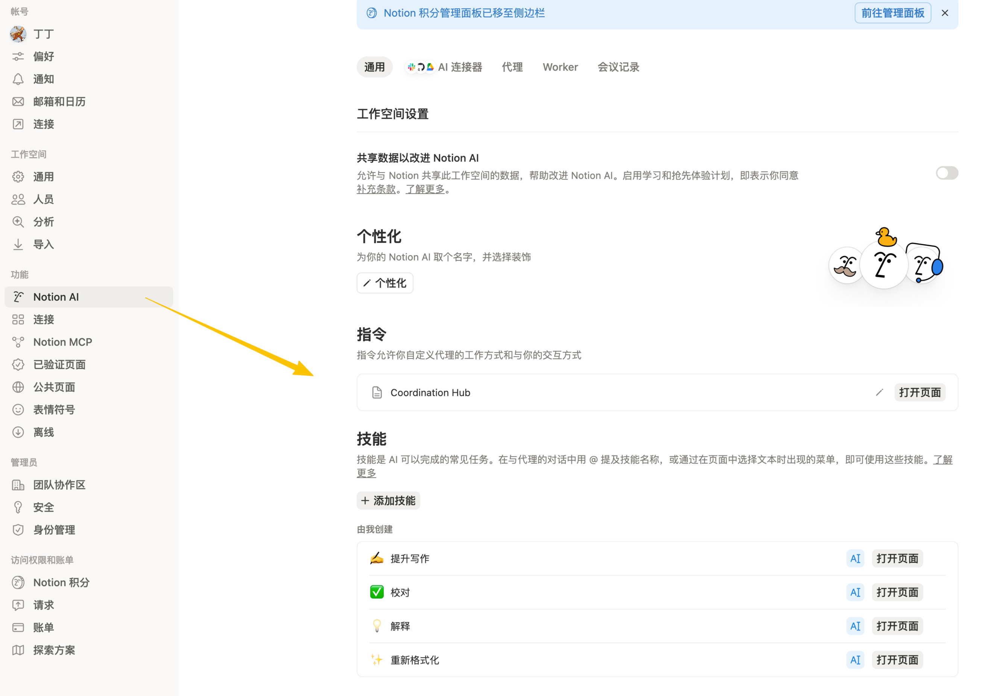

# Notion Setup Guide

中文版本：[notion-setup.zh-CN.md](./notion-setup.zh-CN.md)

Use this only if you want the **optional Notion workflow demo**.

## Roles

| Layer | Role |
| --- | --- |
| Notion AI | Reads the instruction page in `Notion AI > Instructions` |
| MCP Agent | Executes local work through `notion-local-ops-mcp` |
| Projects / Tasks | Optional coordination layer in Notion |
| Local repo | Source of truth for implementation |



## Setup

1. **Start the MCP server**

   ```bash
   cp .env.example .env
   ./scripts/dev-tunnel.sh
   ```

2. **Configure your MCP Agent in Notion**

   - URL: `https://<your-domain-or-tunnel>/mcp`
   - Auth type: `Bearer`
   - Token: `NOTION_LOCAL_OPS_AUTH_TOKEN`

3. **Paste the MCP Agent prompt**

   Use the prompt from [README](../README.md).

4. **Duplicate the public instruction page**

   - [Public Notion instruction-page demo](https://ncp.notion.site/Agent-Start-Here-Template-10eb4da3979d8396861281ca608bc34e)

5. **Bind the duplicated page to Notion AI**

   Go to `Notion AI > Instructions` and select the duplicated page.

## After Duplication

Update these items before real use:

- replace sample project rows
- replace or delete sample task rows
- set `Workspace Root`
- set `Default CWD`
- set `Local Docs Root`

## Smoke Checks

- read a local file
- run `pwd`
- start from a task and verify directory routing

Example:

```text
Open the task "Design Notion project and task system", read its linked project, and tell me which local directory you would use.
```

## Done When

- Notion AI is bound to the duplicated instruction page
- the MCP Agent can read local files and run shell commands
- task -> project routing resolves the correct working directory
