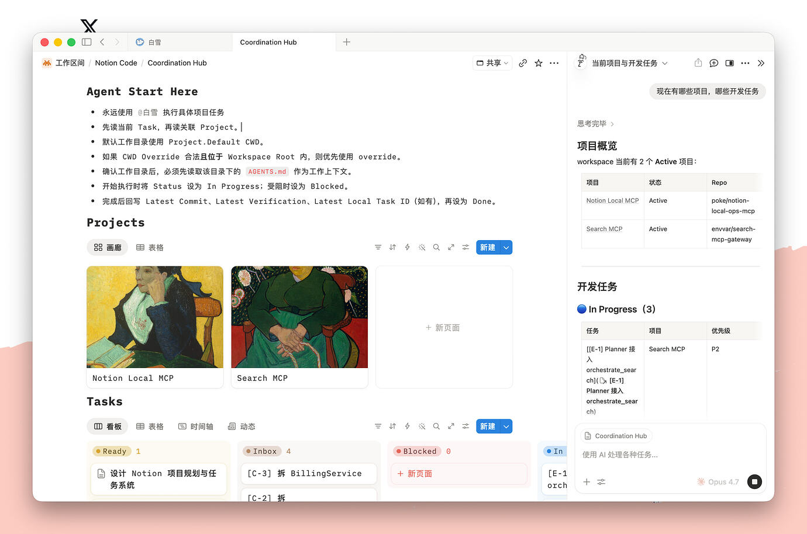
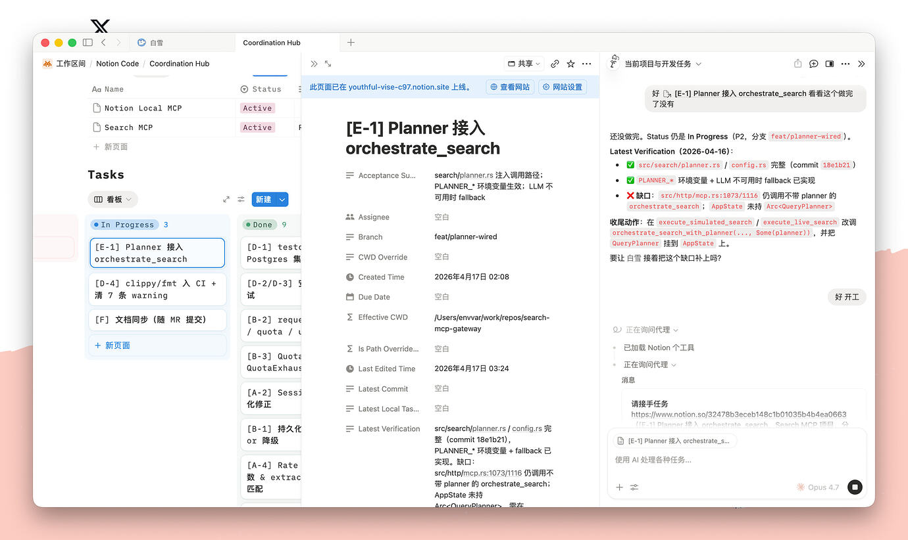
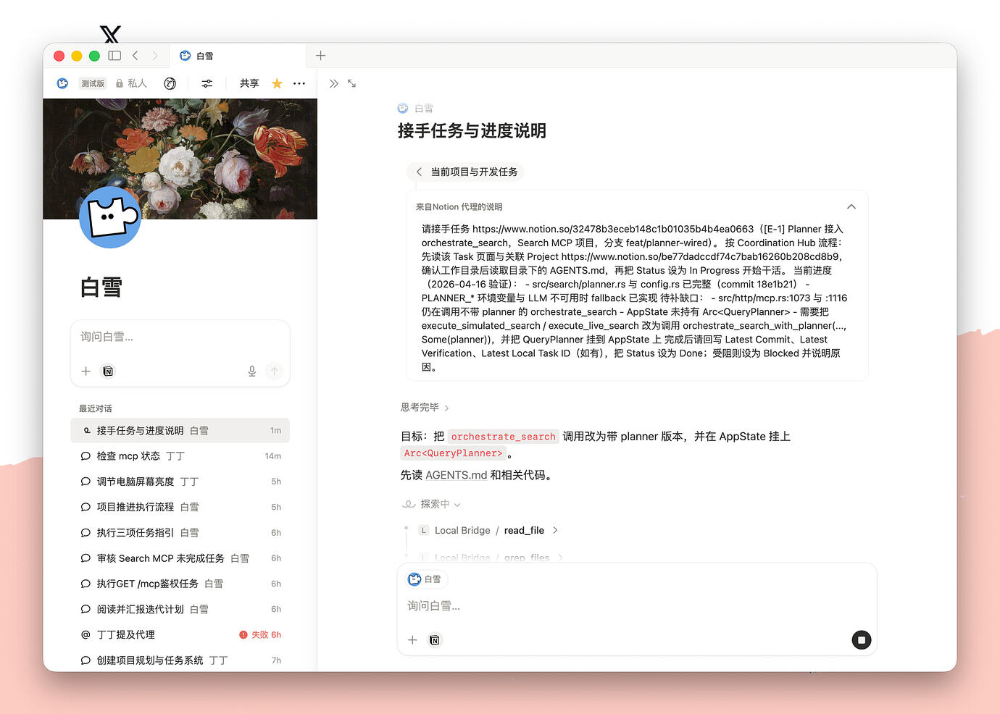

# Notion Workflow Showcase

中文版本：[notion-showcase.zh-CN.md](./notion-showcase.zh-CN.md)

This is an **optional demo workflow** built on top of `notion-local-ops-mcp`.

## 1. Coordination Hub

- `Agent Start Here` + `Projects` + `Tasks`
- right-side Notion AI panel for project context
- coordination only; implementation still lives in the local repo

## 2. Task Execution

- start from a task card
- inspect task properties and effective working directory
- let the **MCP Agent** execute and write back short status / verification

## 3. Handoff / Progress Page

- dedicated page for task handoff
- compact execution brief for the next run
- useful for multi-session or multi-agent work

## Boundary

- **Notion AI**: page-level instruction layer
- **MCP Agent**: execution layer
- **Projects / Tasks**: coordination layer
- **local repo + local docs**: source of truth
